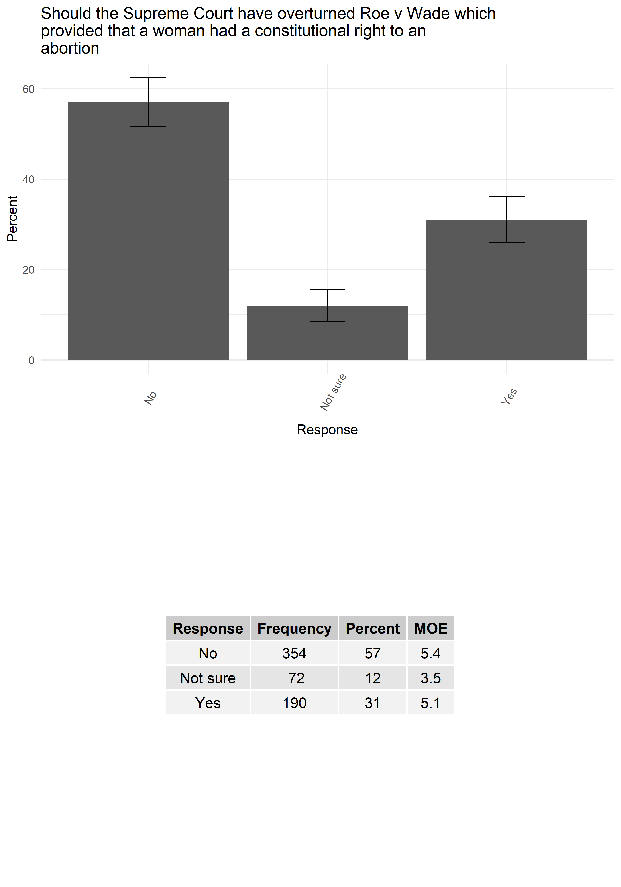
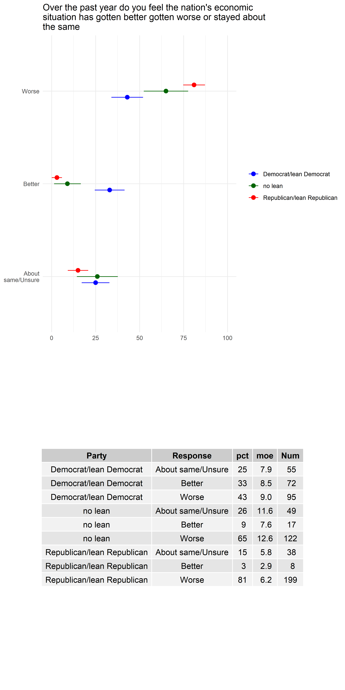
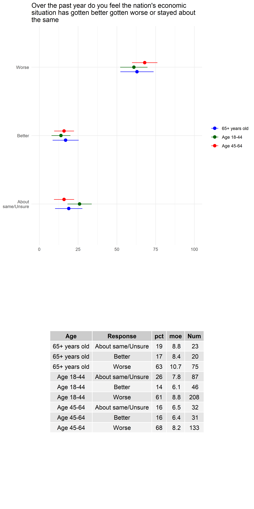

# northern_nov_poll_git
A repository for the Northern Poll data and visualization released by Ohio Northern University on October 18, 2022

## Synopsis 

The purpose of this repository is to host the code and data necessary to produce the weighting, topline, cross tab, and data visualization for the Northern Poll produced 
by Ohio Northern University for the 2023 Ohio Special election. Additionally, the code in the form of R scripts and markdown files can be easily adapted to suit your data visualization 
needs upon downloading the relevant .sav and/or .csv files of the responses from a qualtrics launched survey. 

The details of the files and outputs can be found in the oh_poll_readme.txt file. However, the user should start by running the scripts in the following order:

1) ohio_poll_topline_creatR.R
2) ohio_poll_issue_deepdiveA.R
3) ohio_poll_checkRnov_crosstabs2.R

The above scripts process the saved data from Qualtrics and produces the general topline results, Issue 1 and 2 deep dives, and finally the general crosstabs for the remaining data. 

As can be seen, the topline results take the form of a simplified  table with the percent of the weighted responses, in addition to the margin of error reported next to
it, which is then visualized on the bar plot above. The bar plots all have the confidence intervals likewise visualized. It is important to note that the script produces 
all of these via a standardized loop. Therefore, users need simply have similarly formatted data and change the question item numeric range in order to adapt to their 
own work. 

The ohio_poll_checkRnov_crosstabs2.R script likewise produces all of the cross tab results by party and gender, which takes the following form: 

As can be seen, these plots take a similar form to the topline results. However, the tables now demonstrate the dyadic combination of category with item response, in addition to the percents and margin of errors. The visualization now takes the form of confidence interval plots. These likewise are all created via loops. 

Finally, should the user desire to automate their poll reports, the .Rmd files will be of great help. These read in the file names of all the pngs in their respective folders, orders them based upon creation times, and then orders them into word documents. Even if a bit rough, this should allow the user to get all of their results into one place, and then conduct basic word edits at the margins in order to complete their finalized reports. 
