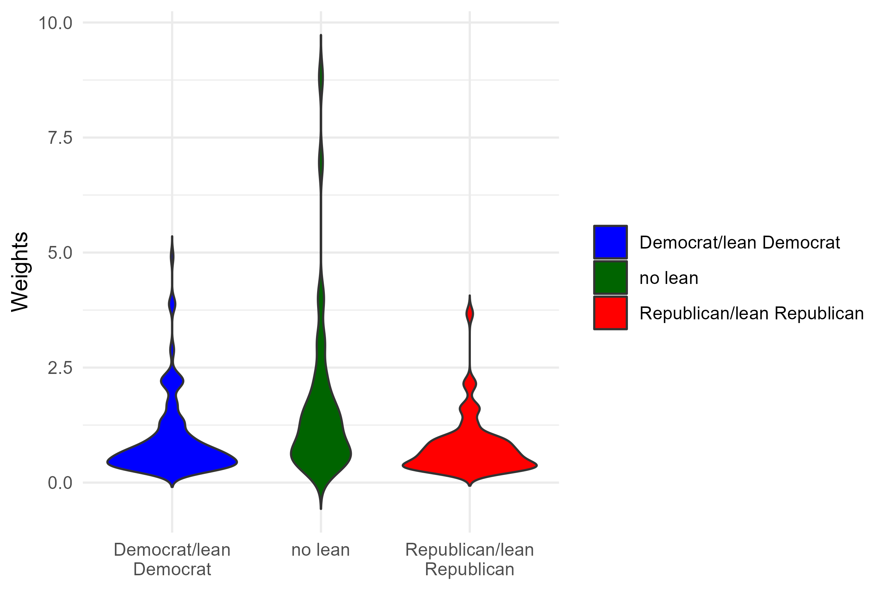

# Methodology 

Ohio Northern University launched the poll in collaboration with the polling firm, Lucid. The survey was conducted among registered voters in the state of Ohio (n=668) via a Qualtrics questionnaire. Individuals sampled were sent an individualized link to the survey. Quotas included were demographics by race, gender, age, education, and party. The poll ran from October 16th to 19th.  

Quotas for race and gender were based upon the 2020 Census results, party based upon the Pew Research Center Party Affiliation by state data, with 42 percent Republicans, 40 percent Democrats, and 18 percent independents.^[Religious Landscape Study. May 30, 2014. Party Affiliation by State. Pew Research Center. https://www.pewresearch.org/religion/religious-landscape-study/compare/party-affiliation/by/state/] 
We weighted race based upon the 2020 race by ethnicity 2020 Census data, and age and education via the 2020 American Community Survey (ACS) 5-year supplement. We weighted the parties by the Pew Data, with those who initially labeled as independent asked to express their partisan lean via the question, 

“Do you think of yourself as closer to the Republican or Democratic Party?”

In total, the survey provides a margin of error at approximately 3.8 percent for a 95 percent confidence interval. We additionally provide the topline results and subsetted margin of errors employing the “pollster” package in R. We plot the distribution of these weights by party in Figure 1 below. We see that the distribution of weights skewed towards higher values for Independents than Republicans or Democrats. The median weighted value for Democrats is 0.59, 0.56 for Republicans, and 1.41 for Independents. At the 95th percentile, the weighted value for Democrats is 2.27, 2.15 for Republicans, and 6.96 for Independents. These results suggest that Independents receive more influence per sampled individual, meaning that it is important to consider the potential role of Independents sampled in the results; should we have sampled an unrepresentative distribution of Independents, then the error in interpreting the preferences for Independents will naturally be skewed. T

In regards to geographic distribution, we additionally asked for the ZIP codes of the respondent. Of Ohio’s ZIP codes, we sampled from 358 unique ZIP codes of the state’s 1,018. The sampled ZIP codes reflect those that comprise 63.4 percent of the population. Additionally, of the ZIP codes sampled, the median sampled ZIP code saw one person sampled, the 95th percentile 4, and the maximum at 11. This suggests that insofar as we sought sampling from a non-clustered geographic sample, we largely succeeded despite the lack of a regional quota filter. 


```{r weights, out.width = "90%", echo=FALSE, fig.align='center',fig.cap="Distribution of survey weights by party" }
#q_order <- readRDS("question_order_vec.rds")



```


# Topline Results 

The following are the top line results for the Northern Poll, a web-based poll of 668 likely voters in Ohio taken from October 16th to 19th.. Dr. Robert Alexander and Dr. John Curiel (Ohio Northern University) led the project. Total weighted percents and margin of errors (MOEs) reported as bar plots and tables below for the question items. 


# Favorability of political/public figures 

```{r favorability_net, out.width = "90%", echo=FALSE, fig.align='center',message=FALSE,warning=FALSE}
library(knitr)
polknow_tab1 <- readRDS("favorability/netfavorable_tab.rds")
polknow_tab1 <- subset(polknow_tab1, select=-c(Favorable,Unfavorable))
colnames(polknow_tab1)[2] <- "Net favorable"
kable(polknow_tab1, caption="Favorability of public figures.", row.names = F)

```

```{r favorability, out.width = "90%", echo=FALSE, fig.align='center',message=FALSE,warning=FALSE}
library(knitr)
polknow_tab1 <- readRDS("favorability/favorable_tab.rds")
kable(polknow_tab1, caption="Favorability of public figures.", row.names = F)

```


## Favorability of political/public figures by party, net favorables 
```{r favorability_party_net, out.width = "90%", echo=FALSE, fig.align='center'}
polknow_tab1 <- readRDS("party_tabs/favorability/netfavorable_tab.rds")
polknow_tab1 <- subset(polknow_tab1, select=-c(Favorable,Unfavorable))


colnames(polknow_tab1)[2:3] <- c("Party","Net favorable")
kable(polknow_tab1, caption="Net favorability of public figures by party.", row.names = F)

```

## Favorability of political/public figures by party, detailed 

```{r favorability_party, out.width = "90%", echo=FALSE, fig.align='center'}
polknow_tab1 <- readRDS("party_tabs/favorability/favorable_tab.rds")
colnames(polknow_tab1)[2] <- "Party"
kable(polknow_tab1, caption="Favorability of public figures by party.", row.names = F)

```


# Primary preferences  

```{r primary, out.width = "90%", echo=FALSE, fig.align='center'}
#q_order <- readRDS("question_order_vec.rds")

#knitr::include_graphics(file_names_pt[5])
#{#id .class width=30 height=20px}
details = file.info(list.files("primary", full.names = T))
details <- details[with(details, order(as.POSIXct(mtime))), ]
files = rownames(details)
#files = files[8:13]
#file_names_pt <- paste0("reports_png",sep="/" ,files) ## looks good
knitr::include_graphics( as.character(files))

```


## Trump supporters willingness to switch candidates   

```{r trump, out.width = "80%", echo=FALSE, fig.align='center'}
#q_order <- readRDS("question_order_vec.rds")

#knitr::include_graphics(file_names_pt[5])
#{#id .class width=30 height=20px}
details = file.info(list.files("trump", full.names = T))
details <- details[with(details, order(as.POSIXct(mtime))), ]
files = rownames(details)
#files = files[8:13]
#file_names_pt <- paste0("reports_png",sep="/" ,files) ## looks good
knitr::include_graphics( as.character(files))

```

# Senate general election match-ups  

```{r senate, out.width = "90%", echo=FALSE, fig.align='center'}
#q_order <- readRDS("question_order_vec.rds")

#knitr::include_graphics(file_names_pt[5])
#{#id .class width=30 height=20px}
details = file.info(list.files("senate", full.names = T))
details <- details[with(details, order(as.POSIXct(mtime))), ]
files = rownames(details)
#files = files[8:13]
#file_names_pt <- paste0("reports_png",sep="/" ,files) ## looks good
knitr::include_graphics( as.character(files))

```

## Senate general election match-ups by party

```{r senate_party, out.width = "75%", echo=FALSE, fig.align='center'}
#q_order <- readRDS("question_order_vec.rds")

#knitr::include_graphics(file_names_pt[5])
#{#id .class width=30 height=20px}
details = file.info(list.files("party_tabs/senate", full.names = T))
details <- details[with(details, order(as.POSIXct(mtime))), ]
files = rownames(details)
#files = files[8:13]
#file_names_pt <- paste0("reports_png",sep="/" ,files) ## looks good
knitr::include_graphics( as.character(files))

```


# Presidential general election match-ups  

```{r potus, out.width = "90%", echo=FALSE, fig.align='center'}
#q_order <- readRDS("question_order_vec.rds")

#knitr::include_graphics(file_names_pt[5])
#{#id .class width=30 height=20px}
details = file.info(list.files("potus", full.names = T))
details <- details[with(details, order(as.POSIXct(mtime))), ]
files = rownames(details)
#files = files[8:13]
#file_names_pt <- paste0("reports_png",sep="/" ,files) ## looks good
knitr::include_graphics( as.character(files))

```

## Presidential general election match-ups by party 

```{r potus_party, out.width = "75%", echo=FALSE, fig.align='center'}
#q_order <- readRDS("question_order_vec.rds")

#knitr::include_graphics(file_names_pt[5])
#{#id .class width=30 height=20px}
details = file.info(list.files("party_tabs/potus", full.names = T))
details <- details[with(details, order(as.POSIXct(mtime))), ]
files = rownames(details)
#files = files[8:13]
#file_names_pt <- paste0("reports_png",sep="/" ,files) ## looks good
knitr::include_graphics( as.character(files))

```


# Attitudes on most pressing issues and direction of country   

```{r rightwrongtrack, out.width = "90%", echo=FALSE, fig.align='center'}
#q_order <- readRDS("question_order_vec.rds")

#knitr::include_graphics(file_names_pt[5])
#{#id .class width=30 height=20px}
details = file.info(list.files("rightwrongtrack", full.names = T))
details <- details[with(details, order(as.POSIXct(mtime))), ]
files = rownames(details)
#files = files[8:13]
#file_names_pt <- paste0("reports_png",sep="/" ,files) ## looks good
knitr::include_graphics( as.character(files))

```


## Attitudes on most pressing issues and direction of country  by party 

```{r rightwrongtrack_party, out.width = "90%", echo=FALSE, fig.align='center'}
#q_order <- readRDS("question_order_vec.rds")

#knitr::include_graphics(file_names_pt[5])
#{#id .class width=30 height=20px}
details = file.info(list.files("party_tabs/rightwrongtrack", full.names = T))
details <- details[with(details, order(as.POSIXct(mtime))), ]
files = rownames(details)
#files = files[8:13]
#file_names_pt <- paste0("reports_png",sep="/" ,files) ## looks good
knitr::include_graphics( as.character(files))

```


# Thoughts on toxicity in politics    

```{r toxic, out.width = "90%", echo=FALSE, fig.align='center'}
#q_order <- readRDS("question_order_vec.rds")

#knitr::include_graphics(file_names_pt[5])
#{#id .class width=30 height=20px}
details = file.info(list.files("toxic", full.names = T))
details <- details[with(details, order(as.POSIXct(mtime))), ]
files = rownames(details)
#files = files[8:13]
#file_names_pt <- paste0("reports_png",sep="/" ,files) ## looks good
knitr::include_graphics( as.character(files))

```

### Thoughts on greatest threat to democracy text cloud

```{r toxic_txt, out.width = "90%", echo=FALSE, fig.align='center'}
#q_order <- readRDS("question_order_vec.rds")

#knitr::include_graphics(file_names_pt[5])
#{#id .class width=30 height=20px}
details = file.info(list.files("toxic_txt", full.names = T))
details <- details[with(details, order(as.POSIXct(mtime))), ]
files = rownames(details)
#files = files[8:13]
#file_names_pt <- paste0("reports_png",sep="/" ,files) ## looks good
knitr::include_graphics( as.character(files))

```

## How Parties characterize each other 

```{r toxic_party_sumtab, out.width = "95%", echo=FALSE, fig.align='center'}
#q_order <- readRDS("question_order_vec.rds")

## dem thoughts on GOP toxic_other_party_dem_on_gop.rds
polknow_dem_on_gop <- readRDS("party_tabs/toxic_other/toxic_other_party_dem_on_gop.rds")
#kable(polknow_dem_on_gop, caption="Knowledge of political institutions.", row.names = F)

## GOP thoughts on Dems toxic_other_party_gop_on_dem.rds
polknow_gop_on_dem <- readRDS("party_tabs/toxic_other/toxic_other_party_gop_on_dem.rds")
#kable(polknow_dem_on_gop, caption="Knowledge of political institutions.", row.names = F)

test_combine <- cbind(polknow_gop_on_dem,polknow_dem_on_gop)
test_combine <- test_combine[,c(1,3,5,7)]
colnames(test_combine) <- c("Republicans think Democrats are...", "% GOP", 
                            "Democrats think Republicans are...","% Dem")
kable(test_combine, caption="How partisans characterize those of the other party", row.names = F)


```

## Thoughts on toxicity in politics by party    

```{r toxic_party, out.width = "75%", echo=FALSE, fig.align='center'}
#q_order <- readRDS("question_order_vec.rds")

#knitr::include_graphics(file_names_pt[5])
#{#id .class width=30 height=20px}
details = file.info(list.files("party_tabs/toxic", full.names = T))
details <- details[with(details, order(as.POSIXct(mtime))), ]
files = rownames(details)
#files = files[8:13]
#file_names_pt <- paste0("reports_png",sep="/" ,files) ## looks good
knitr::include_graphics( as.character(files))

```


### Thoughts on greatest threat to democracy text clouds by party

```{r toxic_party_txt, out.width = "80%", echo=FALSE, fig.align='center'}
#q_order <- readRDS("question_order_vec.rds")

#knitr::include_graphics(file_names_pt[5])
#{#id .class width=30 height=20px}
details = file.info(list.files("party_tabs/toxic_txt", full.names = T))
details <- details[with(details, order(as.POSIXct(mtime))), ]
files = rownames(details)
#files = files[8:13]
#file_names_pt <- paste0("reports_png",sep="/" ,files) ## looks good
knitr::include_graphics( as.character(files))

```

## Thoughts on toxicity in politics by age    

```{r toxic_age, out.width = "75%", echo=FALSE, fig.align='center'}
#q_order <- readRDS("question_order_vec.rds")

#knitr::include_graphics(file_names_pt[5])
#{#id .class width=30 height=20px}
details = file.info(list.files("age_tabs/toxic", full.names = T))
details <- details[with(details, order(as.POSIXct(mtime))), ]
files = rownames(details)
#files = files[8:13]
#file_names_pt <- paste0("reports_png",sep="/" ,files) ## looks good
knitr::include_graphics( as.character(files))

```

### Thoughts on greatest threat to democracy text clouds by age

```{r toxic_age_txt, out.width = "80%", echo=FALSE, fig.align='center'}
#q_order <- readRDS("question_order_vec.rds")

#knitr::include_graphics(file_names_pt[5])
#{#id .class width=30 height=20px}
details = file.info(list.files("age_tabs/toxic_txt", full.names = T))
details <- details[with(details, order(as.POSIXct(mtime))), ]
files = rownames(details)
#files = files[8:13]
#file_names_pt <- paste0("reports_png",sep="/" ,files) ## looks good
knitr::include_graphics( as.character(files))

```


# Political Knowledge 
We asked respondents a series of questions whether they could name the party that held a given branch/level of government, in addition to if they could recall a name and successfully name their party. 

```{r polknow, out.width = "90%", echo=FALSE, fig.align='center', message=FALSE}
library(knitr)
library(Hmisc)
polknow_tab1 <- readRDS("polknow/polknow1.rds")
kable(polknow_tab1, caption="Knowledge of political institutions.", row.names = F)

polknow_tab2 <- readRDS("polknow/polknow2.rds")
kable(polknow_tab2, caption="Knowledge of prominent political figures.", row.names = F)

### now create the code to get the total overall 
final_data2allwB<- readRDS("final_data2allwB.rds")

pid1_wt_range <- wtd.quantile(final_data2allwB$correct_total_pid1,final_data2allwB$final_weight,
                              probs=c(0.25,0.5,0.75))
pid1_wt_range <- as.data.frame(pid1_wt_range)
pid1_wt_range <- t(pid1_wt_range)
pid1_wt_range <- as.data.frame(pid1_wt_range)
pid1_wt_range$Category <- "Institutions"
#pid1_wt_range$item <- "% correct"
colnames(pid1_wt_range) <- c("25th percentile", "Median", "75th percentile", "Category")
### repeat for the second 
pid2_wt_range <- wtd.quantile(final_data2allwB$correct_total_pid2,final_data2allwB$final_weight,
                              probs=c(0.25,0.5,0.75))
pid2_wt_range <- as.data.frame(pid2_wt_range)
pid2_wt_range <- t(pid2_wt_range)
pid2_wt_range <- as.data.frame(pid2_wt_range)
pid2_wt_range$Category <- "People"
#pid2_wt_range$item <- "% correct"
colnames(pid2_wt_range) <- c("25th percentile", "Median", "75th percentile", "Category")

## bind 
pid_df <- rbind(pid1_wt_range,pid2_wt_range)
pid_df <- pid_df[,c(4,1:3)]
### get pcts 
pid_df[1,2:4] <- round((pid_df[1,2:4]/7)*100,1)
pid_df[2,2:4] <- round((pid_df[2,2:4]/6)*100,1)

### round 


### run kable 
kable(pid_df, caption="Overall percent correct for political knowledge.", row.names = F)
```


## Political Knowledge by party 

```{r polknow_party, out.width = "90%", echo=FALSE, fig.align='center', message=FALSE,warning=FALSE}
library(knitr)
library(Hmisc)
library(dplyr)
polknow_tab1 <- readRDS("party_tabs/polknow/polknow1_party.rds")
kable(polknow_tab1, caption="Knowledge of political institutions.", row.names = F)

polknow_tab2 <- readRDS("party_tabs/polknow/polknow2_party.rds")
kable(polknow_tab2, caption="Knowledge of prominent political figures.", row.names = F)

### now create the code to get the total overall 
final_data2allwB<- readRDS("final_data2allwB.rds")

pid1_party <- final_data2allwB %>%
  group_by(party_simp) %>%
  dplyr::summarise(lower_bound=wtd.quantile(correct_total_pid1,final_weight,
                                            probs=c(0.25)),
                   median=wtd.quantile(correct_total_pid1,final_weight,
               probs=c(0.5)),
               upper_bound=wtd.quantile(correct_total_pid1,final_weight,
                            probs=c(0.75)))
### make a df 
pid1_party <- as.data.frame(pid1_party)
pid1_party[,2:4] <- round((pid1_party[,2:4]/7)*100,1)
colnames(pid1_party) <- c("Party","25th percentile", "Median","75th percentile")
pid1_party$Category <- "Institutions"

### now for the people 
pid2_party <- final_data2allwB %>%
  group_by(party_simp) %>%
  dplyr::summarise(lower_bound=wtd.quantile(correct_total_pid2,final_weight,
                                            probs=c(0.25)),
                   median=wtd.quantile(correct_total_pid2,final_weight,
               probs=c(0.5)),
               upper_bound=wtd.quantile(correct_total_pid2,final_weight,
                            probs=c(0.75)))
### make a df 
pid2_party <- as.data.frame(pid2_party)
pid2_party[,2:4] <- round((pid2_party[,2:4]/6)*100,1)
colnames(pid2_party) <- c("Party","25th percentile", "Median","75th percentile")
pid2_party$Category <- "People"


## bind 
pid_df <- rbind(pid1_party,pid2_party)
pid_df <- pid_df[,c(5,1:4)]
### run kable 
kable(pid_df, caption="Overall percent correct for political knowledge by party.", row.names = F)
```

## Political knowledge by age 

```{r polknow_age, out.width = "90%", echo=FALSE, fig.align='center', message=FALSE,warning=FALSE}
library(knitr)
library(Hmisc)
library(dplyr)
polknow_tab1 <- readRDS("age_tabs/polknow/polknow1_party.rds")
kable(polknow_tab1, caption="Knowledge of political institutions.", row.names = F)

polknow_tab2 <- readRDS("age_tabs/polknow/polknow2_party.rds")
kable(polknow_tab2, caption="Knowledge of prominent political figures.", row.names = F)

### now create the code to get the total overall 
final_data2allwB<- readRDS("final_data2allwB.rds")

pid1_party <- final_data2allwB %>%
  group_by(age_simp) %>%
  dplyr::summarise(lower_bound=wtd.quantile(correct_total_pid1,final_weight,
                                            probs=c(0.25)),
                   median=wtd.quantile(correct_total_pid1,final_weight,
               probs=c(0.5)),
               upper_bound=wtd.quantile(correct_total_pid1,final_weight,
                            probs=c(0.75)))
### make a df 
pid1_party <- as.data.frame(pid1_party)
pid1_party[,2:4] <- round((pid1_party[,2:4]/7)*100,1)
colnames(pid1_party) <- c("Age","25th percentile", "Median","75th percentile")
pid1_party$Category <- "Institutions"

### now for the people 
pid2_party <- final_data2allwB %>%
  group_by(age_simp) %>%
  dplyr::summarise(lower_bound=wtd.quantile(correct_total_pid2,final_weight,
                                            probs=c(0.25)),
                   median=wtd.quantile(correct_total_pid2,final_weight,
               probs=c(0.5)),
               upper_bound=wtd.quantile(correct_total_pid2,final_weight,
                            probs=c(0.75)))
### make a df 
pid2_party <- as.data.frame(pid2_party)
pid2_party[,2:4] <- round((pid2_party[,2:4]/6)*100,1)
colnames(pid2_party) <- c("Age","25th percentile", "Median","75th percentile")
pid2_party$Category <- "People"


## bind 
pid_df <- rbind(pid1_party,pid2_party)
pid_df <- pid_df[,c(5,1:4)]
### run kable 
kable(pid_df, caption="Overall percent correct for political knowledge by age.", row.names = F)
```


# Demographics 

## Demographic questions used in screener 

```{r demos_screen, out.width = "90%", echo=FALSE, fig.align='center'}
#q_order <- readRDS("question_order_vec.rds")

#knitr::include_graphics(file_names_pt[5])
#{#id .class width=30 height=20px}
details = file.info(list.files("demos_screen", full.names = T))
details <- details[with(details, order(as.POSIXct(mtime))), ]
files = rownames(details)
#files = files[8:13]
#file_names_pt <- paste0("reports_png",sep="/" ,files) ## looks good
knitr::include_graphics( as.character(files))

```

## Other Demographics 

```{r demos_extra, out.width = "90%", echo=FALSE, fig.align='center'}
#q_order <- readRDS("question_order_vec.rds")

#knitr::include_graphics(file_names_pt[5])
#{#id .class width=30 height=20px}
details = file.info(list.files("demos_extra", full.names = T))
details <- details[with(details, order(as.POSIXct(mtime))), ]
files = rownames(details)
#files = files[8:13]
#file_names_pt <- paste0("reports_png",sep="/" ,files) ## looks good
knitr::include_graphics( as.character(files[1:12]))

```

### Ideology survey experiment 

We divided our sample into three and randomized how respondents rated themselves ideologically. We asked a general 7-point scale from liberal to conservative, a 7-point scale with the positions labeled with their respective positions, and a 7-point scale preceded by a definition of ideology. We find that a definition of ideology leads to a more uniform distribution. 

```{r ideo, out.width = "90%", echo=FALSE, fig.align='center'}
#q_order <- readRDS("question_order_vec.rds")

#knitr::include_graphics(file_names_pt[5])
#{#id .class width=30 height=20px}
details = file.info(list.files("demos_extra", full.names = T))
details <- details[with(details, order(as.POSIXct(mtime))), ]
files = rownames(details)
#files = files[8:13]
#file_names_pt <- paste0("reports_png",sep="/" ,files) ## looks good
knitr::include_graphics( as.character(files[13:15]))

```
