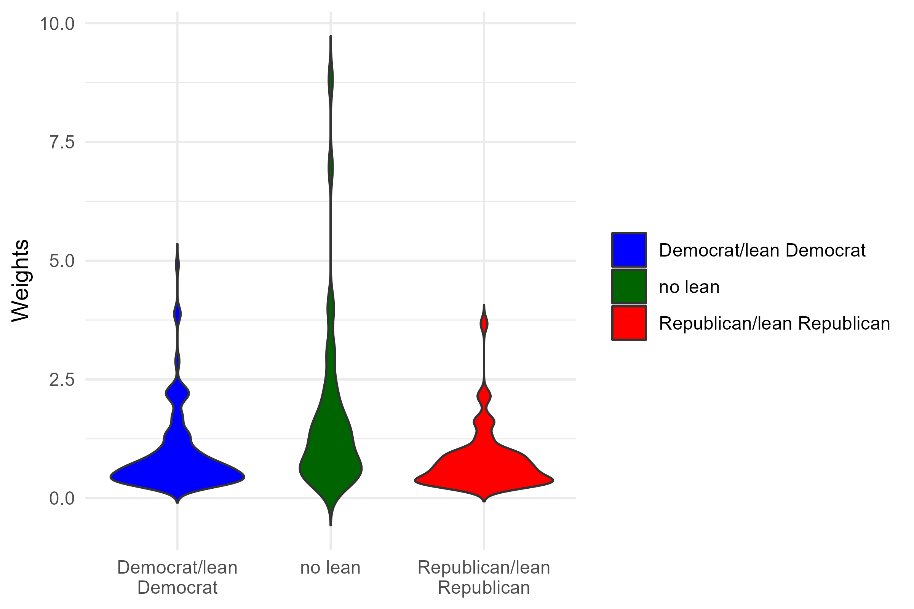
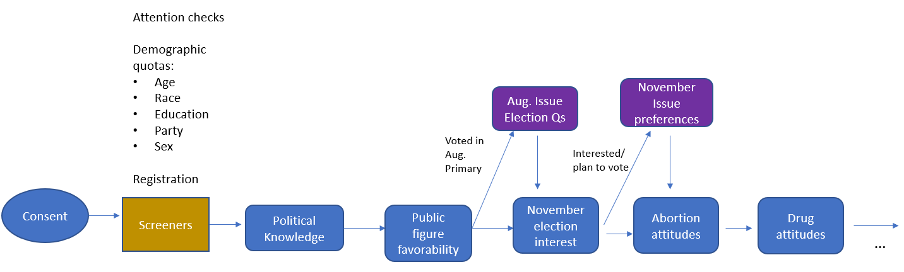

# Methodology 

Ohio Northern University launched the poll in collaboration with the polling firm, Lucid. The survey was conducted among registered voters in the state of Ohio (n=668) via a Qualtrics questionnaire. Individuals sampled were sent an individualized link to the survey. Quotas included were demographics by race, gender, age, education, and party. The poll ran from October 16th to 19th.  

Quotas for race and gender were based upon the 2020 Census results, party based upon the Pew Research Center Party Affiliation by state data, with 42 percent Republicans, 40 percent Democrats, and 18 percent independents.^[Religious Landscape Study. May 30, 2014. Party Affiliation by State. Pew Research Center. https://www.pewresearch.org/religion/religious-landscape-study/compare/party-affiliation/by/state/] 
We weighted race based upon the 2020 race by ethnicity 2020 Census data, and age and education via the 2020 American Community Survey (ACS) 5-year supplement. We weighted the parties by the Pew Data, with those who initially labeled as independent asked to express their partisan lean via the question, 

“Do you think of yourself as closer to the Republican or Democratic Party?”

In total, the survey provides a margin of error at approximately 3.8 percent for a 95 percent confidence interval. We additionally provide the topline results and subsetted margin of errors employing the “pollster” package in R. We plot the distribution of these weights by party in Figure 1 below. We see that the distribution of weights skewed towards higher values for Independents than Republicans or Democrats. The median weighted value for Democrats is 0.59, 0.56 for Republicans, and 1.41 for Independents. At the 95th percentile, the weighted value for Democrats is 2.27, 2.15 for Republicans, and 6.96 for Independents. These results suggest that Independents receive more influence per sampled individual, meaning that it is important to consider the potential role of Independents sampled in the results; should we have sampled an unrepresentative distribution of Independents, then the error in interpreting the preferences for Independents will naturally be skewed. 

In regards to geographic distribution, we additionally asked for the ZIP codes of the respondent. Of Ohio’s ZIP codes, we sampled from 358 unique ZIP codes of the state’s 1,018. The sampled ZIP codes reflect those that comprise 63.4 percent of the population. Additionally, of the ZIP codes sampled, the median sampled ZIP code saw one person sampled, the 95th percentile 4, and the maximum at 11. This suggests that insofar as we sought sampling from a non-clustered geographic sample, we largely succeeded despite the lack of a regional quota filter. 


```{r weights, out.width = "90%", echo=FALSE, fig.align='center',fig.cap="Distribution of survey weights by party" }
#q_order <- readRDS("question_order_vec.rds")



```


The figure below presents the general flow of the diagram and the different manner by which we asked questions and filtered responses. Our screener contained the aforementioned demographics with quota checks to ensure we did not disproportionately sample one group over the other. To ensure that we could employ multiple quota checks without anyone being to prohibitive, we employed primarily dichitomous groupings. For Race, these were white and non-white, gender male and female/other, age 18--44 years old and 45 years old and over, and education High school degree/GED and below versus some college and above. Only for party did we have three groupings based on party identification and party lean. 

For the attention checks we employed a directed choice check where respondents were told to select only a specific choice out of nine, with the question wording as follows: 

This is a simple question. You do not need to be a wine connoisseur or enjoyer of craft beer to answer. When asked about your favorite drink, you need to select prune juice. 

Based on the text above, what is your favorite drink? 


```{r flowdiag, out.width = "90%", echo=FALSE, fig.align='center',fig.cap="Flow of survey question items" }
#q_order <- readRDS("question_order_vec.rds")



```

After the Census demographic questions, the respondents were asked if they are registered to vote. Only those that selected yes were allowed to progress. Following the registration check, we then asked respondents, 

``I work 13 months a year" 

where if the respondent answered, ``Yes, this is true of me," they were excluded. 

Following the screeners, the questions proceeded in line the the figure above. For the August 8th pivot, we asked respondents, ``Did you vote in Ohio's August 2023 Special Election?" For those who answered yes, they were then asked how they voted and why. 

Regarding the November Issue 1 and 2 questions, all respondents were asked their preferences. However, for the purposes of winnowing out unlikely voters, we excluded from analysis those who responded that they did not plan to vote, and those who reported being "Not at all enthusiastic" about the November election. Only after respondents gave their thoughts on the individual items did we follow up with questions on their general attitude on abortion and drugs.^[We attempted different filters, though the results largely remained the same. Excluding voters less likely to turnout further increased the ``Yes" vote for both Issues 1 and 2.]


# November Issues 1 & 2 Election Forecasts  

The following are the top line results for the Northern Poll, a web-based poll of 668 likely voters in Ohio taken from October 16th to 19th. Dr. Robert Alexander and Dr. John Curiel (Ohio Northern University) led the project. Total weighted percents and margin of errors (MOEs) reported as bar plots and tables below for the question items. 


# General interest in November election 
```{r novp, out.width = "90%", echo=FALSE, fig.align='center'}
#q_order <- readRDS("question_order_vec.rds")


#print(file_names_pt[5])

#knitr::include_graphics(file_names_pt[5])
#{#id .class width=30 height=20px}
details = file.info(list.files("novp", full.names = T))
details <- details[with(details, order(as.POSIXct(mtime))), ]
files = rownames(details)
#files = files[8:13]
#file_names_pt <- paste0("reports_png",sep="/" ,files) ## looks good
knitr::include_graphics( as.character(files))


```

Given the above questions for interest in the November election, we constructed an index for interest in the election. For the question "How much thought have you given to the upcoming special November election," we scored on the answers on the following: 

* None/not sure = 0
* Only a little = 1
* Some = 2
* Quite a lot = 3

For the question "How enthusiastic are you about voting in the November election," we scored the responses as follows: 

* Not at all enthusiastic = 0 
* Not so enthusiastic = 1
* Somewhat enthusiastic = 2
* Very enthusiastic = 3 

We proceeded to sum the responses and normalize on a 0 -- 1 scale. Finally, we weighted the results based upon whether a respondent planned to vote, with those who said "no" weighted at 0, those who responded "not sure" at 0.5, and those who responded "yes" at 1. We filtered and analyzed only those who scored above 0.5 for analysis on opinions regarding the Issue 1 election. 

# November Election Issue 1 -- Abortion (Survey experiment)

For attitudes regarding the Issue 1 election for November, we subsetted to those who received a November interest score above 0.5.  Further, we do find an increase in those who would vote Yes for Issue 1 if the ballot language follows that used by the League of Women Voters as opposed to the one that appears on the actual ballot.


### Issue 1 Actual Ballot language 

The language we used to reflect the actual Issue 1 ballot language is as follows:


The following amendment, Issue 1, will be voted upon in this November's election. It will: 

1. Establish in the Constitution of the State of Ohio an individual right to one's own reproductive medical treatment, including but not limited to abortion;

2. Create legal protections for any person or entity that assists a person with receiving reproductive medical treatment, including but not limited to abortion;

3. Prohibit the State from directly or indirectly burdening, penalizing, or prohibiting abortion before an unborn child is determined to be viable, unless the State demonstrates that it is using the least restrictive means;

4. Grant a pregnant woman's treating physician the authority to determine, on a case-by-case basis, whether an unborn child is viable;

5. Only allow the State to prohibit an abortion after an unborn child is determined by a pregnant woman's treating physician to be viable and only if the physician does not consider the abortion necessary to protect the pregnant woman's life or health; and

6. Always allow an unborn child to be aborted at any stage of pregnancy, regardless of viability if, in the treating physician's determination, the abortion is necessary to protect the pregnant woman's life or health.

Do you agree or disagree with the proposed amendment (Issue 1)? 

### League of Women Voters' Language 

For the treatment language, we made use of the shorter language employed by the League of Women Voters (LWV) -- and the broader Ohioans United for Reproductive Rights movement -- that was sought for the ballot language before Ohio Secretary of State Frank LaRose rejected it. The LWV likewise created a campaign titled "Read the Amendment" as part of their vote Yes on Issue 1 campaign.^["The Right to Reproductive Freedom with Protections for Health and Safety." Ohioans United for Reproductive Rights. , https://www.readtheamendment.com/] The language is as follows: 

The following amendment, Issue 1, will be voted upon in this November's election:

1. Every individual has a right to make and carry out one’s own reproductive decisions, including but not limited to decisions on contraception, fertility treatment, continuing one’s own pregnancy, miscarriage care, and abortion.

2. The State shall not, directly or indirectly, burden, penalize, prohibit, interfere with, or discriminate against either an individual’s voluntary exercise of this right or a person or entity that assists an individual exercising this right, unless the State demonstrates that it is using the least restrictive means to advance the individual’s health in accordance with widely accepted and evidence-based standards of care.

3. However, abortion may be prohibited after fetal viability. But in no case may such an abortion be prohibited if in the professional judgment of the pregnant patient’s treating physician it is necessary to protect the pregnant patient’s life or health.

4. As used in this Section, “Fetal viability” means “the point in a pregnancy when, in the professional judgment of the pregnant patient’s treating physician, the fetus has a significant likelihood of survival outside the uterus with reasonable measures. This is determined on a case-by-case basis”; and “State” includes any governmental entity and political subdivision.

Do you agree or disagree with the proposed amendment (Issue 1)? 

### Pie charts for Issue 1

```{r novi_pie, out.width = "90%", echo=FALSE, fig.align='center'}
#q_order <- readRDS("question_order_vec.rds")


#print(file_names_pt[5])

#knitr::include_graphics(file_names_pt[5])
#{#id .class width=30 height=20px}
details = file.info(list.files("pie_charts/novi", full.names = T))
details <- details[with(details, order(as.POSIXct(mtime))), ]
files = rownames(details)
#files = files[8:13]
#file_names_pt <- paste0("reports_png",sep="/" ,files) ## looks good
knitr::include_graphics( as.character(files))


```


### Bar charts for Issue 1

```{r novi, out.width = "90%", echo=FALSE, fig.align='center'}
#q_order <- readRDS("question_order_vec.rds")


#print(file_names_pt[5])

#knitr::include_graphics(file_names_pt[5])
#{#id .class width=30 height=20px}
details = file.info(list.files("novi", full.names = T))
details <- details[with(details, order(as.POSIXct(mtime))), ]
files = rownames(details)
#files = files[8:13]
#file_names_pt <- paste0("reports_png",sep="/" ,files) ## looks good
knitr::include_graphics( as.character(files))


```

## Issue 1 preferences by party

The results below present the survey experiment results by ballot language. We see that the Democrats largely remain the same despite randomized treatment condition. Increases in support for Issue 1 arise primarily among Independents. Independents are 43-41 agree v disagree with the actual ballot language, compared to 70-30 for the LWV language. Republicans likewise increase in support, going from 29-54 agree to disagree, up to 45-48 for the LWV language. The results hold when asked for outright voting intention. 

```{r novi_party, out.width = "90%", echo=FALSE, fig.align='center'}
#q_order <- readRDS("question_order_vec.rds")

details = file.info(list.files("party_tabs/novi", full.names = T))
details <- details[with(details, order(as.POSIXct(mtime))), ]
files = rownames(details)
#files = files[8:13]
#file_names_pt <- paste0("reports_png",sep="/" ,files) ## looks good
knitr::include_graphics( as.character(files))


```

## Issue 1 preferences by gender

For gender, we see a smaller gap in diverging preferences by group. While women tend to be more supportive of Issue 1, the confidence intervals do overlap, in part due to the wider margins caused by the reduced data. However, we additionally see that the language does have an impact. Women tend to be steady in their support of Issue 1, at 63-30 percent agree/disagree with the actual ballot language, compared to 68-24 agree/disagree for the LWV language. However, men see increased agreement with the amendment, moving from 41-41 agree/disagree with the actual ballot language, to 66-30 agree-disagree with the LWV language. 

```{r novi_gender, out.width = "90%", echo=FALSE, fig.align='center'}
#q_order <- readRDS("question_order_vec.rds")

details = file.info(list.files("gender_tabs/novi", full.names = T))
details <- details[with(details, order(as.POSIXct(mtime))), ]
files = rownames(details)
#files = files[8:13]
#file_names_pt <- paste0("reports_png",sep="/" ,files) ## looks good
knitr::include_graphics( as.character(files))


```


## General abortion attitudes

### Pie charts 

```{r abortion_pie, out.width = "90%", echo=FALSE, fig.align='center'}
#q_order <- readRDS("question_order_vec.rds")

details = file.info(list.files("pie_charts/abortion", full.names = T))
details <- details[with(details, order(as.POSIXct(mtime))), ]
files = rownames(details)
#files = files[8:13]
#file_names_pt <- paste0("reports_png",sep="/" ,files) ## looks good
knitr::include_graphics( as.character(files))

```

### Bar charts and tables 

```{r abortion_bar, out.width = "90%", echo=FALSE, fig.align='center'}
#q_order <- readRDS("question_order_vec.rds")

details = file.info(list.files("abortion", full.names = T))
details <- details[with(details, order(as.POSIXct(mtime))), ]
files = rownames(details)
#files = files[8:13]
#file_names_pt <- paste0("reports_png",sep="/" ,files) ## looks good
knitr::include_graphics( as.character(files))

```

# Attitudes towards marijuana 

We also asked a series of questions related to marijuana usage. There is likely an oversample of marijuana users within the state (67-31 percent yes/no), though the results do demonstrate increased tolerance towards the drug. Within the topline results, only nine percent reported that they would think less of a friend or family member if they used marijuana. 

```{r mjiss_topline, out.width = "90%", echo=FALSE, fig.align='center'}
#q_order <- readRDS("question_order_vec.rds")

#knitr::include_graphics(file_names_pt[5])
#{#id .class width=30 height=20px}
details = file.info(list.files("mjiss", full.names = T))
details <- details[with(details, order(as.POSIXct(mtime))), ]
files = rownames(details)
#files = files[8:13]
#file_names_pt <- paste0("reports_png",sep="/" ,files) ## looks good
knitr::include_graphics( as.character(files))

```

## Attitudes towards Marijuana by party  

Overall, Democrats tend to be the most supportive of marijuana across the board. Notably, 59 percent of Democrats perceive it as acceptable to use marijuana socially in public, compared to only 24 percent of Republicans. However, similar levels of Democrats, Republicans and Independents used marijuana, and all groupings opposed to complete bans on marijuana. 


```{r mjiss_party, out.width = "90%", echo=FALSE, fig.align='center'}
#q_order <- readRDS("question_order_vec.rds")

#knitr::include_graphics(file_names_pt[5])
#{#id .class width=30 height=20px}
details = file.info(list.files("party_tabs/mjiss", full.names = T))
details <- details[with(details, order(as.POSIXct(mtime))), ]
files = rownames(details)
#files = files[8:13]
#file_names_pt <- paste0("reports_png",sep="/" ,files) ## looks good
knitr::include_graphics( as.character(files))

```

## Attitudes towards Marijuana by age  

We broke down age groups by 18-44 years old, 45-64 years old, and 65 years old and over. We see generational divides across the board, especially in comparing the youngest age group to the oldest. Most over 65 report never having tried marijuana, in direct contrast to the other two groupings. Those 18 to 44 were also most likely to say that using marijuana socially in public is acceptable at 50 percent, compared to 40 percent for those 45-64, and only 20 percent above the age of 65. 


```{r mjiss_age, out.width = "90%", echo=FALSE, fig.align='center'}
#q_order <- readRDS("question_order_vec.rds")

#knitr::include_graphics(file_names_pt[5])
#{#id .class width=30 height=20px}
details = file.info(list.files("age_tabs/mjiss", full.names = T))
details <- details[with(details, order(as.POSIXct(mtime))), ]
files = rownames(details)
#files = files[8:13]
#file_names_pt <- paste0("reports_png",sep="/" ,files) ## looks good
knitr::include_graphics( as.character(files))

```

# Drug knowledge 

We asked respondents a set of 12 drugs on their degree of knowledge of the substances. We included two that were fake -- JAC and Shuck -- as a means to test false knowledge of drugs. We then asked respondents their preferences of legalization of drugs.  

```{r drug_know, out.width = "90%", echo=FALSE, fig.align='center'}
library(knitr)
polknow_tab1 <- readRDS("drugat_tab/drug_know.rds")
kable(polknow_tab1, caption="Self reported knowledge of drugs.", row.names = F)

```

# Preferences for legalization of drugs 

```{r drug_pref, out.width = "90%", echo=FALSE, fig.align='center'}
library(knitr)
polknow_tab2 <- readRDS("drugat_tab/drug_pref.rds")
kable(polknow_tab2, caption="Agreement on legalizing drugs.", row.names = F)

```


# The August 8th Election Debrief  

Respondents were asked if they voted in Ohio's August 8th election. If they responded yes, they were asked a set of questions related to how and why they voted the way that they did.  

```{r augp, out.width = "90%", echo=FALSE, fig.align='center'}
library(knitr)
details = file.info(list.files("augp", full.names = T))
details <- details[with(details, order(as.POSIXct(mtime))), ]
files = rownames(details)

aug_table = readRDS(files[1])
kable(aug_table, caption = "How voted in August 8th primary.")
#files = files[8:13]
#file_names_pt <- paste0("reports_png",sep="/" ,files) ## looks good
knitr::include_graphics( as.character(files[2]))


```


# Demographics 

## Demographic questions used in screener 

```{r demos_screen, out.width = "90%", echo=FALSE, fig.align='center'}
#q_order <- readRDS("question_order_vec.rds")

#knitr::include_graphics(file_names_pt[5])
#{#id .class width=30 height=20px}
details = file.info(list.files("demos_screen", full.names = T))
details <- details[with(details, order(as.POSIXct(mtime))), ]
files = rownames(details)
#files = files[8:13]
#file_names_pt <- paste0("reports_png",sep="/" ,files) ## looks good
knitr::include_graphics( as.character(files))

```

## Other Demographics 

```{r demos_extra, out.width = "90%", echo=FALSE, fig.align='center'}
#q_order <- readRDS("question_order_vec.rds")

#knitr::include_graphics(file_names_pt[5])
#{#id .class width=30 height=20px}
details = file.info(list.files("demos_extra", full.names = T))
details <- details[with(details, order(as.POSIXct(mtime))), ]
files = rownames(details)
#files = files[8:13]
#file_names_pt <- paste0("reports_png",sep="/" ,files) ## looks good
knitr::include_graphics( as.character(files[1:12]))

```


